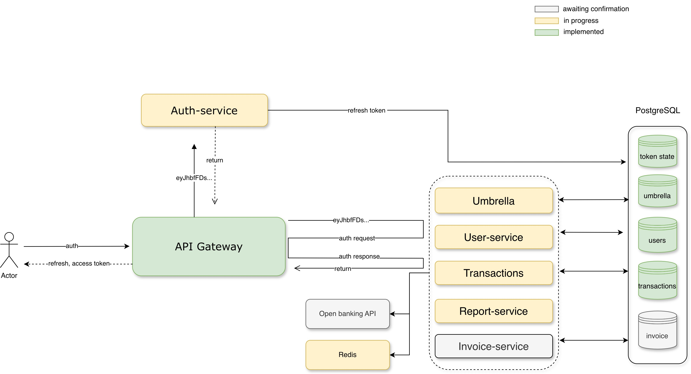

# Umbrella 

"Umbrella" is aimed at creating a comprehensive solution to facilitate the management of business financial operations, billing processes, invoice generation, and financial reporting. This platform is being developed utilizing cutting-edge tools and frameworks such as Docker Compose, Java 17, Spring Boot 3.2, Spring Security 6, Spring Cloud, Spring Data, MVC, WebFlux, and PostgreSQL. 
The project is divided into several microservices, each of which is responsible for a specific task. The services are as follows:

High level architecture diagram.

## Usage Guide
### Swagger UI
This can be accessed via `http://localhost:8761/swagger-ui/index.html`.

### Eureka
This can be accessed via `http://localhost:8761

## Build Tasks
A sequence of tasks is utilized for building this Java-based microservices project. The tasks are managed using `Taskfile`, with each task being prefixed by `task`, such as `task build` or `task deploy`. `Docker-compose` is used in some of these tasks to orchestrate the services.

1. **clean-docker:** Stops and deletes all Docker containers and images.
2. **empty-database:** Deletes all data in postgres Docker container and creates a new postgres-db-service Docker container.
3. **create-database:** Generates a new postgres-db-service Docker container.
4. **redeploy SERVICE={service-name}:** Redeploy a specific service.
5. **up:** Builds the entire project structure.

## How to Initiate the Project
Follow these steps to use this project:

1. Java SDK 17 has to be installed.
2. Import the project as a Maven/Gradle project in your preferred IDE.
3. Lombok plugin has to be installed in your IDE.
4. Resolve all the dependencies.
5. Create a `.env` file in the root directory and add the following environment variables:

   #### Given global environment variables:
   - ENVIRONMENT: dev (or prod)

   #### PostgreSQL environment variables:
   - DB_IMAGE_VERSION: postgres:16.1
   - DB_PORT: 5432
   - DB_USER: [your-username]
   - DB_PASSWORD: [your-password]
6. Build the project by running `task up`.
7. Uncomment port 5005 in `docker-compose.yml` to enable remote debugging.
